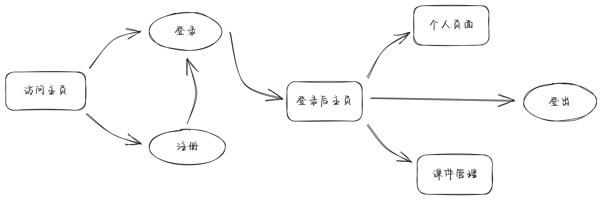
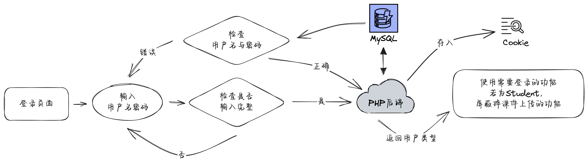
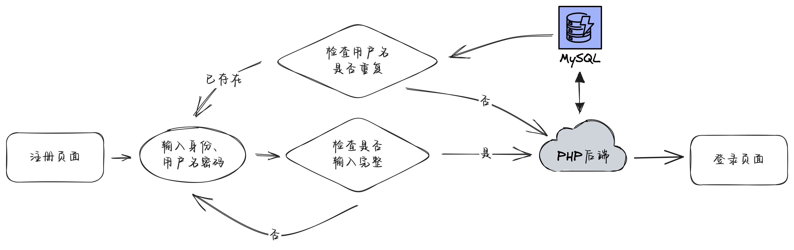

# MyWeb

[](https://opensource.org/licenses/MIT)

## 简介

这是一个前端基于HTML + CSS + JavaScript，后端基于PHP的课件管理网站demo，也是我大二下学期的Web课程设计作业

## 网站功能

1. 用户管理
    - 用户注册
    - 用户登录
    - 用户注销
    - 用户信息修改
2. 课件管理
    - 课件上传
    - 课件下载
    - 课件列表展示

## 使用方法

1. 将项目文件夹放入服务器的根目录下
2. 在MySQL中创建名为`MyWeb`的数据库，执行如下命令创建`user`表
```sql
create table user
(
    id          int auto_increment,
    username    TEXT                               not null,
    password    TEXT                               not null,
    type        enum ('student', 'teacher')        not null,
    create_time datetime default current_timestamp not null,
    constraint user_pk
        primary key (id)
);
```
3. 修改php文件中关于数据库的相关配置（如用户名、密码、数据库名等）
4. 在浏览器中访问Nginx或者Apache服务器的地址即可

## 项目结构

```
MyWeb
├─README.md
├─index.html            // 主页
├─login.html            // 登录页面
├─register.html         // 注册页面
├─afterLogin.html       // 登录后的主页
├─personalCenter.html   // 个人中心（修改用户名、密码）
├─fileCenter.html       // 课件中心（上传、下载课件）
├─script.js             // JavaScript脚本（大部分功能实现）
├─styles
|  ├─style.css          // 自定义样式
|  ├─animate.min.css    // 动画样式（来自Animate.css）
|  └─normalize.css      // 浏览器样式重置（来自Normalize.css）
├─php
|  ├─login.php          // 登录验证
|  ├─register.php       // 注册验证
|  ├─updateUserInfo.php // 更新用户信息
|  ├─uploadFile.php     // 上传课件
|  ├─downloadFile.php   // 下载课件
|  └─getFileList.php    // 获取课件列表
└─images
   ├─*.png              // 一些嵌入README的图片
   └─favicon.ico        // 网站图标
```

## 逻辑流程





## 演示思路

1. 介绍本机环境，配置mysql与网站目录
2. 展示网站主页，介绍网站功能
    1. 先注册一个学生账号
    2. 登录后，介绍个人中心页面
    3. 介绍课件中心页面（发现无法上传）
    4. 登出账号，注册一个教师账号
    5. 登录后，介绍课件中心页面（发现可以上传）
3. 介绍用户登录逻辑，cookie数据库等
4. 介绍一些亮点（动画、响应式布局等）
5. GitHub

## 页面截图


